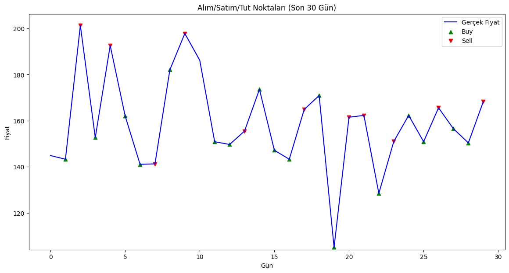
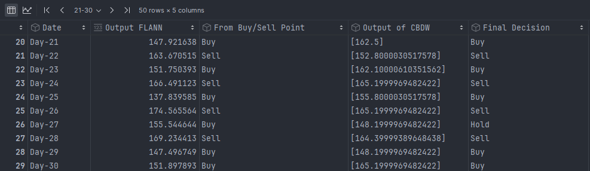

# FLANN-CBDW Stock Forecast

This project aims to predict stock prices and generate **Buy/Sell/Hold** signals using an optimized **FLANN (Function Link Artificial Neural Network)** model and **Case-Based Dynamic Window (CBDW)** approach. The FLANN model is optimized using the **Firefly Algorithm (FFA)** and supported by CBDW, which analyzes similar price patterns from historical data. This combined approach aims to provide more accurate and reliable trading signals.

## Table of Contents
- [Installation](#installation)
- [Technologies Used](#technologies-used)
- [Data Preparation and Model Training](#data-preparation-and-model-training)
- [Results](#results)
- [References and Acknowledgments](#references-and-acknowledgments)

## Installation

### Cloning the Repository

- To get started, clone the GitHub repository to your local machine:

```bash
git clone https://github.com/berkaykaratas07/Stock-Prediction-Using-FLANN-CBDW.git
```
- Navigate into the project directory:
  
```bash
cd FLANN-CBDW Stock Forecast
```

### Installing Requirements

- The required libraries are listed in the requirements.txt file. Install them using:
  
```bash
pip install -r requirements.txt
```

### TA-Lib Installation

- The **TA-Lib** library is provided as a .whl file in the requirements directory of this project. To install it, run:

```bash
pip install requirements/TA_Lib-0.4.0.32-cp311-cp311-win_amd64.whl
```
⚠️ If you are using a different platform or encounter any issues, you can refer to the [official TA-Lib installation guide](https://github.com/cgohlke/talib-build/releases).


## Technologies Used
- **Python**: For overall project development, data processing, and modeling.
- **yFinance**: To retrieve historical stock price data.
- **Pandas**: For data manipulation and preprocessing.
- **NumPy**: For numerical computations, including matrix operations and custom calculations.
- **Datetime**: To manage date and time data, especially for calculating date intervals.
- **TA-Lib**: To calculate technical indicators such as RSI (Relative Strength Index) and moving averages.
- **scikit-learn**:
  - **train_test_split**: To split the dataset into training and testing sets.
  - **MinMaxScaler**: For scaling data to a normalized range.
- **reflame (MhaFlnnRegressor)**: For implementing and optimizing the FLANN model with Firefly Algorithm (FFA).
- **SciPy**: Specifically, `scipy.spatial.distance.euclidean` is used for calculating Euclidean distances, crucial for CBDW.
- **Matplotlib**: For visualizing the results, including price trends and Buy/Sell/Hold points.
- **pytest**: For testing various components of the project, ensuring functionality and correctness of code.

## Data Preparation and Model Training

In this project, **400 days of hourly stock price data** (e.g., "TUPRS.IS") is retrieved using `yFinance`. The model operates in the following steps:

1. **Data Retrieval and Preprocessing**: Stock data is obtained, missing values are filled, and technical indicators like `Close` and `Volume` are calculated:
   - **RSI (Relative Strength Index)**: A 14-period RSI value.
   - **MAVI (Moving Average Volume Indicator)**: The ratio of volume moving averages.
   
2. **Data Scaling**: Data is scaled to a range of 0-1 using `MinMaxScaler`.

3. **FLANN Model Prediction**: The **FLANN** model is optimized with the **Firefly Algorithm (FFA)** to make predictions and generate **Buy/Sell/Hold** signals.

4. **Support with CBDW**: The **Case-Based Dynamic Window (CBDW)** method identifies the most similar past price patterns to confirm the FLANN predictions. If FLANN and CBDW signals align, the final signal is confirmed; otherwise, a **Hold** decision is given.

## Results

The following results illustrate the **Buy/Sell/Hold** signals generated based on FLANN and CBDW methods:

### FLANN Output with Buy/Sell/Hold Decisions
This visualization shows the Buy/Sell/Hold signals generated by the FLANN model alone.



### Final Buy/Sell/Hold Decisions with CBDW Output
This visualization shows the final Buy/Sell/Hold signals after verification using the CBDW method.



These results illustrate the final decision based on the FLANN predictions and CBDW validation.

## References and Acknowledgments

This project is inspired by the following research:

- **Bebarta, D. K., Das, T. K., Chowdhary, C. L., & Gao, X.-Z.** (2021). An Intelligent Hybrid System for Forecasting Stock and Forex Trading Signals using Optimized Recurrent FLANN and Case-Based Reasoning. *International Journal of Computational Intelligence Systems, 14*(1), 1763–1772. DOI: [10.2991/ijcis.d.210601.001](https://doi.org/10.2991/ijcis.d.210601.001)

Special thanks to **Thieu Pham** for developing the `reflame` library.

For more information or questions, please contact `berkaykaratas054@gmail.com`.


